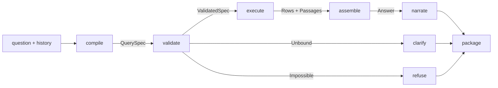
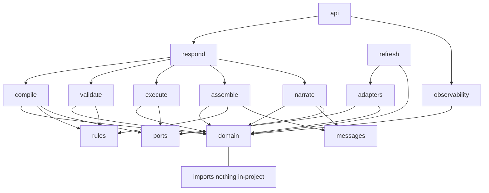
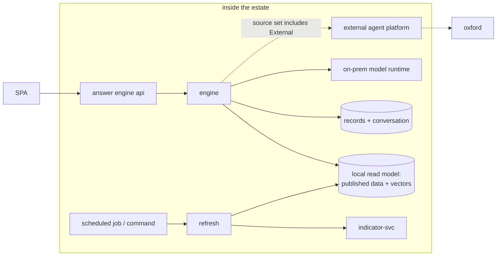
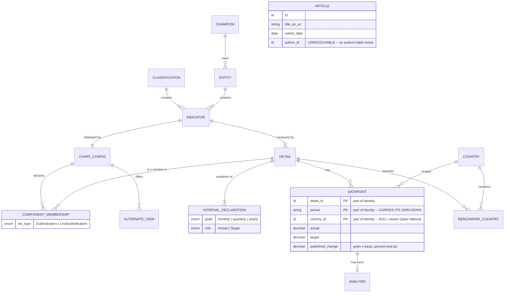
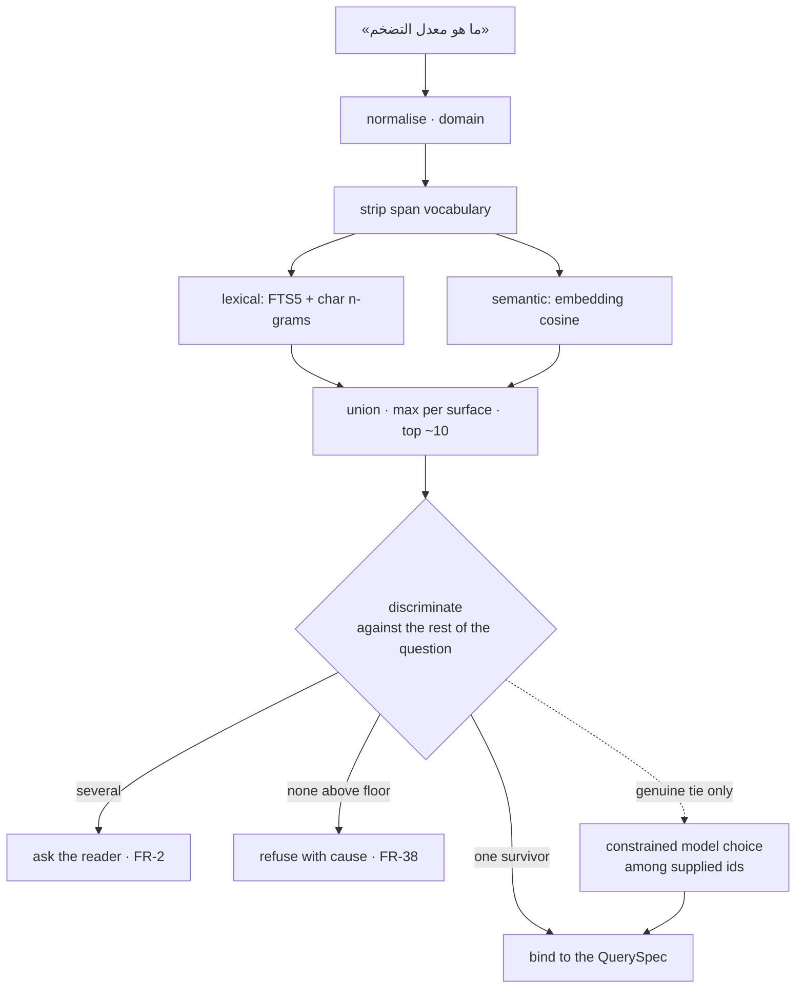

# Architecture Spine — Ask AI Answer Engine

## Design Paradigm

**Ports and adapters, wrapped around a pure query-compiler pipeline.**

A question is *compiled* to a `QuerySpec`, *validated* against the catalogue, *executed* by exact
key lookup, *assembled* into a provenance-carrying answer, and only then *narrated*. Compile,
validate, assemble and narrate-guard are pure; execute and narrate-call are the only IO.



| Layer | Namespace | Purity |
| --- | --- | --- |
| Domain types | `askai/domain/` | pure, imports nothing in-project |
| Rule data + loaders | `askai/rules/` | pure after load |
| Question → QuerySpec | `askai/compile/` | pure; calls ports for candidates |
| QuerySpec → ValidatedSpec | `askai/validate/` | pure |
| ValidatedSpec → Rows | `askai/execute/` | IO, via ports only |
| Rows → Answer | `askai/assemble/` | pure |
| Answer → prose | `askai/narrate/` | pure guard; calls one port |
| Response assembly + source admission | `askai/respond/` | orchestration; orders packages, never mutates one |
| Port protocols | `askai/ports/` | declarations only |
| Adapters | `askai/adapters/{model,external,readmodel,index,store}/` | IO |
| Bilingual strings | `askai/messages/` | data |
| HTTP edge | `askai/api/` | edge |
| Out-of-band ingest | `askai/refresh/` | IO, never on the answer path |
| Records + degradations | `askai/observability/` | IO |

## Invariants & Rules



### AD-1 — The QuerySpec is the single binding artifact

- **Binds:** all of F1, F2, F3
- **Prevents:** components each choosing their own rows, grain or period — the defect behind three periods on one card and four independent row selections
- **Rule:** A frozen `QuerySpec(detail, period, country_scope, measure, operation)` is produced exactly once per answerable question, before any data access. No layer past `compile/` may set, widen or reinterpret a field. Anything not on the spec cannot be fetched or composed. *(Grain is not a field — `Period` carries it; see the ERD note and AD-19.)*

  **A field has three states, not two.** `Bound` — the reader was specific and it is resolved. `Unbound(reason)` — the reader was not specific enough, and the answer is a clarification or a refusal. **`Deferred`** — the reader was perfectly clear but the value cannot be known without the data: *"what is inflation now?"* names `Latest`, which is determinate yet unresolvable in a pure layer. So `PeriodSpec = Exact | Range | Latest | LastN(n, grain)`, and **`execute/` resolves the deferred forms against FR-8's rule** (most recent actual at or before today, no placeholders), recording what it resolved to. Collapsing `Deferred` into `Unbound` would make the commonest question in the system look ambiguous; collapsing it into `Bound` would drag a data dependency into `compile/` and break AD-2.

### AD-2 — Dependency direction is one-way and machine-enforced

- **Binds:** all
- **Prevents:** the old inversion where the newer pipeline depended on `main.py`, leaving nothing extractable
- **Rule:** `domain/` imports nothing in-project. `compile/`, `validate/`, `assemble/`, `narrate/` may not import `adapters/` — only `ports/`. `agents/` may orchestrate but may not reach inside `assemble/` or `narrate/`. Enforced by `import-linter` in CI from the first commit; a violation fails the build.

### AD-3 — Figures originate only in `execute/`

- **Binds:** F2, F4, F5, FR-55
- **Prevents:** a computed, reformatted or model-authored number reaching a reader
- **Rule:** Only `execute/` may produce a numeric value, and only by exact key lookup `(detail, grain, period, country)`. No similarity search returns a figure. `narrate/` receives already-formatted strings and may not parse, alter or restate them. A number that cannot be traced to a row does not exist.

### AD-4 — Published change columns are selected, never recomputed

- **Binds:** FR-19, FR-20, FR-21
- **Prevents:** the F-005/F-029 class — self-computed growth between arbitrary points, unlabelled basis, percent/pp conflation
- **Rule:** A change value is obtained by selecting the published column matching `(grain × basis)`. Computation is permitted only when no published column exists, and the result is then marked `Derived` with its inputs. `Percent` and `pp` are distinct types in `domain/`; no implicit conversion exists between them.

### AD-5 — National scope is a query shape, not a country value

- **Binds:** FR-9, FR-10, FR-11, FR-11b
- **Prevents:** Qatar silently vanishing from its own comparison — the benchmark config names Qatar in all 21 declared sets while the data names it in none of 8,127 rows
- **Rule:** `CountryScope` is a closed type: `National | Named(set) | DeclaredBenchmarks`. The national selection is a distinct query from the benchmark selection, and a cross-country result is their union, assembled in one place. No call site constructs a country filter containing the literal "Qatar". Ingest preserves the blank country as the national marker and never backfills it.

### AD-6 — Every answer element carries a provenance envelope

- **Binds:** F4, F10, FR-45, FR-96
- **Prevents:** provenance becoming a render-time label that brevity can drop, and the two kinds of truth blurring
- **Rule:** Every element is `Element(content, class, source_ref)` where class is one of **`Measured`** (a published row), **`Derived`** (computed here, inputs stated), **`Attributed`** (analyst text bound to a datapoint), **`Article`** (published editorial — dated, authored, *not* bound to any indicator), **`External`** (third-party), **`Absent`**. `Article` is deliberately separate from `Attributed`: an analyst note carries an indicator, grain, period and country, an article carries none of them, and collapsing the two is how an opinion piece comes to stand in for a statistic. The class is set at construction in `assemble/` and is immutable. **There is no constructor that produces an element without a `source_ref`.**

### AD-7 — The assembler is the closed-world enforcement point

- **Binds:** FR-77–FR-81, NFR-11
- **Prevents:** closed-world compliance degrading into a prompt instruction that cannot be verified
- **Rule:** `assemble/` rejects any element whose `source_ref` does not resolve against the loaded knowledge base, and the rejection is a typed `Degradation`, not a silent drop. Enforcement is structural: because `narrate/` cannot construct elements (AD-6, AD-8) and `execute/` is the only figure source (AD-3), there is no path by which unsourced content reaches a package. Tested by construction, not by sampling.

### AD-8 — Model output is parsed, validated, and discarded on failure

- **Binds:** F5, FR-2, FR-12, FR-54
- **Prevents:** a model becoming load-bearing on an endpoint that cannot guarantee its output shape
- **Rule:** **The parser-plus-validator is the floor, and correctness never depends on more.** Every model call returns text, which a total parser converts to a candidate value, which a validator checks against a closed domain (an enum member, an id present in the catalogue, a sub-question set). Failure at either step yields the declared fallback and a counted `Degradation` — never a retry loop that eventually accepts something. `narrate/` output is prose the guard accepts or discards wholesale, leaving the deterministic answer standing.

  **JSON mode is available and is used; it is not a substitute for the validator.** The existing runtime already sends `response_format: {"type": "json_object"}` and already falls back once, within budget, when the server rejects it — ratify both. But `json_object` guarantees *syntactic* validity, **not shape**: a well-formed object with an invented indicator id passes JSON mode and must still be rejected. Schema-constrained decoding, where the runtime supports it, tightens the parse further and changes nothing downstream. **The validator runs on every call regardless**, because one that only runs when the model misbehaves is one nobody has tested.

### AD-9 — Two model paths, separated by purpose

- **Binds:** F10, NFR-3, NFR-5, NFR-10
- **Prevents:** a latency floor and a prose-only contract being imposed on internal calls that need neither; and direct model coupling anywhere
- **Rule:** Two distinct ports, never conflated.
  - **`ModelPort`** — internal calls the engine makes to do its own job: candidate discrimination, operation classification, multi-part detection, narration. These are small, structured and latency-sensitive. They run against a **direct on-prem model runtime**, synchronously, with a per-call budget. **Confirmed to exist**: the current tree already carries an OpenAI-compatible chat-completions client (vLLM or Ollama) with `temperature: 0` and a fixed seed. What changes is that these calls stop being routed through a job API whose polling interval alone is a latency floor on every request.
  - **`ExternalAgentPort`** — the third-party view, where an agent platform is genuinely the integration point. Job-submit-and-poll, prose result, its own budget, fetched in parallel from t=0.

  No module outside `adapters/` knows either protocol. Every call on either port is budgeted and abandonable. The engine makes no call outside the estate on the `ModelPort`.

### AD-9a — The published dataset is materialised locally, not fetched per question

- **Binds:** F2, AD-3, NFR-2, NFR-6, NFR-7
- **Prevents:** a network round trip on the answer path for a dataset small enough to hold entirely in memory, and a corpus that cannot run without a live service
- **Rule:** The whole published layer — 189 indicators, 289 details, **8,127 datapoints**, 1,031 analyses and the reference tables — is materialised into the local store on refresh and read from there. Answering performs **no synchronous call to indicator-svc**; that call belongs to the refresh path (FR-108), where it is an operator action with visible state. Consequences that make this the right trade: exact-key lookup becomes a local index probe, the corpus runs with no service and no network, and the whole answer path is unit-testable per NFR-6. Staleness is bounded by refresh cadence and is an operator-visible fact, not a hidden one.

### AD-10 — One answer path; source is a property of content, not a mode

- **Binds:** FR-82–FR-87, FR-52
- **Prevents:** three routing paths with three sets of guards drifting apart — and approved figures appearing under an external badge, or external prose being read as approved
- **Rule:** The reader's three-way choice is **kept** — it is a real product decision about which model answers. It is expressed as a **source admission set** on the request, served by **one** answer path:

  | Reader selects | Admission set | Engine behaviour |
  | --- | --- | --- |
  | SCEAI Indicators | `{Approved}` | approved answer only |
  | Oxford Economics | `{External}` | external view only, always caveated |
  | Combined | `{Approved, External}` | both, **side by side, for the reader to compare** |

  The approved answer is composed identically in every case that admits it; there is no Combined-specific composition. Combined exists so a reader can weigh the two answers against each other — which is precisely why they must never be reconciled.

  `ExternalAnswer` is a distinct type from `Answer` with **no conversion between them and no function taking both and returning one** — the merge is impossible at the type level, not forbidden by discipline. The external view is fetched in parallel from t=0 on its own budget and appended as a separate package only after every guard has run. An approved-data refusal is still shown in Combined; the external answer never stands in for it.

  In `{External}`, the closed-world rule (AD-7) does not apply — nothing claims to be approved — but the caveat does, unconditionally, since the reader has no approved anchor to judge against.

  `narrate/` is the only thing that may construct an `AnswerPackage`; the response assembler may order and concatenate packages but never mutate one or reach inside it.

  *What changes from the current system is not the choice but its implementation: three routing paths carrying three sets of guards become one path with a source set, so provenance separation is a type invariant rather than a rule each path must remember.*

### AD-11 — Rules, messages and aliases are loaded data, validated at startup

- **Binds:** F8, F6, FR-11a, FR-63
- **Prevents:** the founding defect — business logic that cannot be enumerated, reviewed or changed without reading code
- **Rule:** Grain selection, country scope, latest-value definition, refusal wording, rounding, display format, disambiguation thresholds, country aliases and all reader-facing strings live in versioned data files under `rules/` and `messages/`. They are schema-validated at startup and the service **fails to start** on an invalid or missing file. No reader-facing literal appears in code. A rule not expressible as data about a `QuerySpec` is a code path and needs a recorded reason to exist.

### AD-12 — Only the published layer is answerable

- **Binds:** FR-38, FR-38a, FR-77
- **Prevents:** unapproved content reaching a reader through a convenience join
- **Rule:** The published catalogue is the sole source of values, periods, definitions and analysis. The base CMS layer is reachable only through a separate read-only `UnpublishedCatalogPort` exposing **names and existence only**, used solely to shape a refusal (342 indicators exist but are unpublished). No type crosses from that port into `Answer`.

### AD-13 — The semantic index is exact, in-process, and atomically swapped

- **Binds:** FR-1, FR-35, FR-101, NFR-4, NFR-7
- **Prevents:** an unnecessary vector service, and readers seeing a half-applied refresh
- **Rule:** **Search is semantic and lexical, fused — and exact.** Roughly **7,400 vectors** after semantic chunking (AD-27) — ~1,135 name surfaces, ~5,800 analyst chunks, ~450 article chunks, EN + AR — are searched by **exact brute-force cosine in process**, fused with SQLite FTS5 lexical scores for the `names` collection. No ANN library, no vector server: at 768 dimensions this is 23 MB resident and 5.7M multiply-adds per exhaustive scan, and after the mandatory scope filter (AD-14) a typical query cosines a few dozen rows. Vectors persist in the read-model database and load at startup. A refresh builds them whole into a new file and swaps by reference; a request holds one index for its lifetime and never observes a mixture. **Numeric rows are never embedded.** Should the corpus grow an order of magnitude, the migration is an ANN index behind the same `IndexPort`, changing no contract.

### AD-14 — Retrieval is filtered before it is ranked

- **Binds:** FR-35, FR-101
- **Prevents:** the F-015 class — a December analysis retrieved for a May question, on the wrong grain, with a benchmark that does not exist
- **Rule:** Analyst-passage search takes the `ValidatedSpec` as a mandatory argument and applies its scope (indicator, grain, period, country) as a hard pre-filter; out-of-scope passages are not candidates and cannot be surfaced by a high score. Articles carry no indicator key, so article retrieval requires an explicit relevance floor and returns nothing rather than a nearest neighbour.

### AD-15 — Failure is typed, counted and surfaced

- **Binds:** F9, NFR-8, NFR-10, FR-75
- **Prevents:** the `except Exception` density that made a rule which stopped firing indistinguishable from one never reached
- **Rule:** No bare `except Exception` outside adapter boundaries. Every degradation is a typed `Degradation(kind, where, detail)` counted in metrics and carried into the answer record. **Degradations travel on the result value — never through an ambient collector or contextvar**, which would reintroduce the shared mutable state AD-2 exists to prevent and would make `assemble/` untestable in isolation. Fail-soft remains policy; silence does not. Loss of the model degrades prose only; loss of the external agent degrades to the approved answer with the gap stated.

### AD-16 — One recorder, writing once, from the finished package

- **Binds:** FR-74, FR-90, NFR-9, F11
- **Prevents:** partial records assembled from several call sites, and an unreconstructable answer
- **Rule:** `observability/` writes exactly one record per request, after the package is final, containing the `QuerySpec`, the binding mechanism per field, row ids used, rules fired, agent and external outcome, degradations, and prompt version. No other module writes to the record store. Record size is bounded so any operator-chosen retention is workable.

### AD-17 — Determinism is a property of the spec, not of the prose

- **Binds:** NFR-1, NFR-1a
- **Prevents:** tolerating variance in the one non-deterministic step; and a corpus that cannot replay
- **Rule:** **Spec determinism is a hard gate:** the same question, history and `today` compile to the same `QuerySpec` on repeated runs, and multi-part detection partitions identically. A differing `QuerySpec` is a failing test, not variance. **Prose determinism is best-effort and is not asserted** — KAP's determinism controls are unknown; seed and temperature are pinned where it allows. `today` is an explicit field on the compile input, carried on the `QuerySpec`, and part of every cache key derived from it — a cached resolution must never survive a date boundary.

### AD-18 — One formatter owns value-to-string, with an explicit mode

- **Binds:** FR-47, FR-48, F2, F5
- **Prevents:** two composers rendering the same row differently on one card — the F-004 defect, and the ambiguity behind finding 18
- **Rule:** A single `Formatter` converts a value to a string, taking the detail's published format and an explicit `FormatMode(Headline | Evidence)`. `Headline` applies the display rounding rule; `Evidence` preserves published precision. **No composer may build a numeric string by any other route.** The mode is a property of the position in the answer, decided once, not chosen per composer.

### AD-19 — Every spec field has one binder and a stated precedence

- **Binds:** F1, F7, FR-4, FR-5, FR-65, FR-66
- **Prevents:** two binders both claiming a field — finding 152's territory, and the reason a follow-up could silently change more than one dimension
- **Rule:** For each `QuerySpec` field the precedence is fixed: **named-in-question ▸ inherited-from-history ▸ rule default ▸ `Unbound`**. Precedence resolves *before* the spec is constructed; AD-1's "bound exactly once" means one binder owns each field's final value. A follow-up overrides only the fields its question names; every other field inherits unchanged.

### AD-20 — Exclusive table ownership, and the index never shares a writer with the record store

- **Binds:** AD-13, AD-16, NFR-7, F11
- **Prevents:** an index rebuild blocking a live request under SQLite's single-writer lock, and two modules owning one table
- **Rule:** Each table has exactly one owning module; no other module writes it. The connection policy is WAL, set once at startup. **The semantic index is built into a separate database file and swapped by reference** (AD-13) — it is never written in place alongside live records or conversation state. Readers of a swapped index hold their reference for the request's lifetime.

### AD-21 — Refresh is an out-of-band operation, never a reader-reachable endpoint

- **Binds:** AD-9a, FR-108, FR-109, FR-110, NFR-7
- **Prevents:** the read model going stale silently; and a mutating operation sitting on the reader's surface
- **Rule:** The engine holds a local copy of the published data (AD-9a), so **a refresh mechanism is mandatory** — the admin panel is deferred, the refresh is not. It runs out of band as a scheduled job or a command, never as an endpoint the reader path can reach. It reports what changed, what failed, and what is now being served; **ingest rejections are surfaced with counts and examples, never swallowed.** Every answer can state the freshness of the data behind it. If an operator surface is added later, it calls this same mechanism rather than introducing a second one.

### AD-22 — No autonomous agents on the answer path, and no orchestration framework

- **Binds:** all of F1–F5, AD-3, AD-8, AD-9
- **Prevents:** the two most likely ways this rebuild reacquires the defect it exists to remove — an agent that reasons its way to a number, and a framework that spreads past the module meant to contain it
- **Rule:** The answer path is a **deterministic pipeline with bounded model call-sites**, not an agent system. There are four: candidate discrimination, operation classification, multi-part detection, and narration. Each is single-shot, budgeted, validated against a closed domain, and discardable. **No component may loop, plan, re-plan, call a tool of its own choosing, or decide what to do next.** The data forecloses the alternatives — 92% of datapoints carry no analyst text, the indicator-relationship table is empty, and change values are published columns — so an agent has nothing to reason over and every opportunity to invent.

  **No LangChain or equivalent orchestration framework is a dependency**, and adding one is a spine change rather than a library choice. Its two justifications do not apply: there is no model provider to abstract (AD-9 is a direct runtime behind one port) and no vector store to abstract (AD-13 is exact in-process search). Retry, budget, fallback and caching live in one adapter, written once.

### AD-23 — The lens is a view over one answer, never an input to it

- **Binds:** FR-59, FR-59a–FR-59d, FR-63
- **Prevents:** flipping the depth toggle re-answering the question — the guarantee FR-59a makes, left as a promise if the lens is a request parameter
- **Rule:** **The lens is not a request parameter, and not a field on every element.** One `/api/ask` call returns the complete answer; which elements each lens shows is a **`role` → lens mapping held in `rules/`** (AD-11) — reviewable, changeable without a deploy, and stated once rather than repeated on every element. The reader's toggle applies that mapping; it never issues a request. Because no request is made, a lens flip **cannot** produce a different `QuerySpec`, grain or figure: the violation is unrepresentable rather than forbidden. Element text is composed server-side, so the bilingual catalogue remains the only source of reader-facing strings. `refusal` and `clarification` packages, and the `scope` and `absent` roles, appear in **both** lenses — an executive is never shielded from why an answer is thin (FR-59d).

### AD-24 — The engine does not authenticate; it requires an identified caller

- **Binds:** FR-74, NFR-9, NFR-4
- **Prevents:** auth being *removed* rather than *relocated* — and an audit record that cannot say who was answered
- **Rule:** The engine owns no session, login or user store. It **requires a caller identity to be asserted by the surrounding platform** (gateway, SSO, or the hosting application) and records it with every answer; a request arriving with no asserted identity is recorded as anonymous, and that fact is itself recorded rather than assumed away. The engine performs no authorisation beyond validating that `sources` is within the closed set. **Two consequences must be accepted explicitly, not by default:** the engine is reachable by anything that can route to it, so its exposure is a network-topology decision made outside this spine; and traceability under NFR-9 is only as good as the identity the platform asserts. If no platform asserts one, answers are auditable but not attributable — which is a weaker guarantee than the PRD assumes, and should be stated to whoever relies on it.

### AD-25 — Resolution is generate → discriminate → decide, and discrimination is structural before it is semantic

- **Binds:** F1, FR-1, FR-2, FR-3, AD-1
- **Prevents:** a similarity score being asked to carry a distinction it never encoded — the defect behind *"a chart of Qatar's GDP"* resolving to a venture-capital indicator, and behind 257 of 320 names being ambiguous
- **Rule:** Resolution runs in three stages and **may not be collapsed into one scoring pass**.
  1. **Generate** — high recall, no model. Union of lexical (FTS5 + character n-grams) and semantic (embedding cosine) over the `names` collection, **one vector per surface with the maximum taken across surfaces** — never a single combined vector per indicator. Yields ~10 candidates.
  2. **Discriminate** — score the survivors against **the rest of the question**, using structural signals the compiler has already extracted: named grain, named period and whether a candidate actually publishes it, named country, named group or sector, and unit shape. **This stage is deterministic and runs before any model call.**
  3. **Decide** — exactly one survivor binds; several become a disambiguation response (FR-2); none becomes a refusal with a stated cause (FR-38). A model is consulted **only** when stage 2 leaves a genuine tie, and then only to choose among supplied candidate ids (AD-8).

  Stage 2 is new and is where the data pays: *"a chart of Qatar's GDP from 2022 to 2025"* has 15 lexical candidates, but few publish yearly data spanning 2022–2025 in a GDP-shaped unit. **The question already contains its own tie-break**; the current system throws that information away by scoring the whole question as one bag of text.

### AD-26 — One normalisation, in `domain/`, used by index and query alike

- **Binds:** F1, F6, AD-13, AD-25
- **Prevents:** an index and a query folding text differently — which is not hypothetical: it is finding 121's Arabic half, where a reviewed frame word could never match because the query had already been folded differently by the time the comparison ran
- **Rule:** There is **exactly one** `normalise()` — NFKC, strip diacritics and tatweel, fold `أإآ→ا`, `ى→ي`, `ة→ه`, collapse punctuation and whitespace — and it lives in `domain/`. Index build, query, lexical match and alias lookup all call it. The current tree has three copies (`candidates.normalise`, `retrieval.normalise`, `groups.norm`) whose own docstrings warn that a third spelling would reintroduce the defect. A test asserts the index path and the query path resolve to the same function object; adding a second normaliser fails the build.

### AD-27 — Semantic chunking: the author's boundaries first, embeddings to refine

- **Binds:** AD-13, AD-14, FR-35, FR-101
- **Prevents:** fixed-size chunking fusing unrelated claims into one vector, and splitting a figure away from the period and unit that make it true
- **Rule:** Chunking is **structure-first, embedding-second**, and never a fixed character window.
  1. **Respect the published structure.** **81% of analyst passages are `<ul>/<li>` bullet lists — 5,269 items, median 184 chars, p90 409, none above 1,045.** Each bullet is one self-contained analytic claim the analyst wrote as a unit; **the `<li>` is the chunk.** Prose passages chunk at `<p>`. Articles carry **no headings at all**, so the paragraph is their only published boundary.
  2. **Merge upward, semantically, only what cannot stand alone.** A unit below the minimum length is merged with its neighbour **while adjacent-unit embedding similarity stays above a floor** — 25 analyst bullets and 73 of 301 article paragraphs qualify. Similarity decides, length only triggers the question.
  3. **Split downward at a semantic minimum, not a character count.** Oversized units — no analyst bullet, but article paragraphs run to 8,757 chars — split at the sentence boundary where adjacent-sentence embedding distance is **greatest**, so the cut lands where the subject actually turns.
  4. **A chunk has exactly one `source_ref`, and merging never crosses a provenance boundary.** Two datapoints, two articles, or two languages never combine — AD-6 would otherwise be unenforceable at retrieval time.
  5. **A chunk must be independently quotable.** A split that separates a figure from its period, unit or subject is invalid regardless of what the embeddings say, because FR-46 requires every quoted passage to carry its own attribution and period.

  Chunk boundaries are recorded with the chunk, so a retrieved passage can always be traced to its exact position in the published source.

### AD-28 — The narration guard compares against the answer, and defaults to discarding

- **Binds:** FR-53–FR-58, AD-3, AD-8
- **Prevents:** the hardest failure in the system — prose that is fluent, grounded-looking, and says *more* than the answer supports. F-005 and F-029 are both this shape, and a guard specified only as "accepts or discards" would be written as a spellcheck
- **Rule:** The guard is **a comparison against the composed answer, not an inspection of the prose.** It runs four checks, in order, and **any failure discards the whole prose and leaves the deterministic answer standing** — never a partial edit, never a repair.
  1. **Numbers.** Every numeric token in the prose must appear in the answer's formatted elements. A number not in the answer, in any form, is a failure. Formatting is compared post-normalisation so `2.6` and `2.60` do not race.
  2. **Named entities.** Every indicator, country, period and unit named in the prose must appear in the `QuerySpec` or an element. *"compared with Saudi Arabia"* fails when no Saudi row was fetched.
  3. **Relational claims.** Comparative and causal vocabulary — *higher, lower, fastest, because, driven by, due to* — is permitted **only** when an element of the matching kind exists: a comparison element for comparative language, an `attributed` or `article` element for causal language. `reasoning/` never states a cause, so neither may prose.
  4. **Scope.** The prose must not widen the answer: no period, country or indicator outside the spec's scope.
- **Default is discard.** An unparseable or ambiguous guard result discards. A guard that errs toward keeping is worse than no guard, because it launders a defect through a component that looks like a safeguard. Every discard is a counted `Degradation` (AD-15), and a rising discard rate is a prompt or model problem surfacing early rather than a silent quality drift.

### AD-29 — Prompts are versioned artifacts, gated by the corpus

- **Binds:** AD-8, AD-16, F8, NFR-1
- **Prevents:** prompts being the one part of system behaviour that changes without review, test or audit trail — in a system whose founding complaint is invisible business logic
- **Rule:** Every prompt is a **versioned file in the repository**, immutable once published: a change is a new version, never an edit. Which version is active is configuration, so a rollback is a config change rather than a deploy. **Every answer records `prompt_id@version` and its hash** (AD-16), so a card questioned months later can be traced to exactly what the model was told. **A prompt change runs the corpus in CI and fails the build on a regression** — the same gate as code and rule changes, because a prompt is behaviour. A missing or altered prompt fails loudly at startup; it never falls back to another.

### AD-30 — Retrieval is evaluated, and its floors are derived rather than chosen

- **Binds:** AD-13, AD-14, AD-25, AD-27, FR-35, FR-101
- **Prevents:** relevance floors being tuned by feel, and the article path — which has no foreign key and therefore no natural constraint — degrading invisibly behind a green corpus
- **Rule:** Retrieval carries **its own labelled set and its own CI gate**, separate from the answer corpus. The answer corpus asserts on the `QuerySpec`; it cannot tell whether the right passage came back.

  **Ground truth, by collection:**
  - **`analyst` — free, from the data.** Every `P04` passage is already bound to a datapoint, so `(indicator, grain, period, country) → the passage(s) that belong to it` is published ground truth. Labelled pairs are generated from that binding, not hand-written.
  - **`names` — free, from the findings.** Finding 42's Arabic-morphology cases, F-014's paraphrases and F-003's 15 GDP candidates are already question→expected-indicator pairs with known answers.
  - **`articles` — hand-labelled, and there is no alternative.** No indicator key exists, so relevance is a human judgement. 67 documents is small enough to label exhaustively against a question set, and doing so is not optional: this is the one path where nothing in the data constrains a wrong answer.

  **The metric that governs the article path is precision on questions that should return nothing.** The failure mode is a plausible, topical, wholly unrelated article retrieved for a question it does not answer — so the labelled set **must** include questions whose correct result is an empty one, and the gate is the rate at which those stay empty. Recall alone would reward a system that always returns its nearest neighbour.

  **Floors are derived, not chosen.** For each collection, measure the score distributions of relevant and irrelevant passages over the labelled set, and derive the floor from them. **If the distributions overlap materially, a floor is not sufficient and a structural discriminator is required** — this is finding 126's lesson, generalised: *a flat score cannot carry a distinction the index never encoded.* For `analyst` the structural discriminator already exists as AD-14's mandatory scope filter; for `articles` it does not, which is the reason FR-101 demands a floor **and** demonstrable topical binding rather than a nearest neighbour.

  **The derivation is recorded with the value.** A floor in `rules/` carries the labelled-set version it was derived from and the measured separation, so a future change is an argument with evidence rather than a preference. Re-derived whenever the embedding model, the chunking, or the corpus changes — any of which moves the scoring space.

## Consistency Conventions

| Concern | Convention |
| --- | --- |
| Naming — domain | The PRD glossary (§5.0) is binding vocabulary. `detail` is always the indicator detail, never "more information"; use `depth` for the latter. `grain`, `period`, `measure`, `basis`, `country_scope`, `classification`, `entity` carry their glossary meanings in code. |
| Naming — modules | Layer directories are verbs (`compile`, `validate`, `execute`, `assemble`, `narrate`); adapters are nouns named for what they adapt. |
| Ids | Published CMS ids are opaque strings, never parsed. Internal ids are `ULID`. Rule ids are `R-<AREA>-<SLUG>`, stable, never reused. |
| Periods | Always the published forms `YYYY`, `YYYY-Qn`, `YYYY-MM`, typed as `Period`; never a bare string, never a `date`. **`Period` owns its grain** — `period.grain` is derived, never a separate argument. A signature taking both a period and a grain is a design error (see the ERD note). |
| Numbers | `Decimal` end to end; never `float` for a published value. Formatting happens once, in `assemble/`, from the detail's published format. |
| Language | Every reader-facing string is a message id plus parameters. `Lang` is an explicit argument, never inferred at the point of rendering, never a global. |
| Errors | Typed `Degradation` for soft failures, typed exceptions at adapter boundaries only. HTTP errors carry a stable machine code plus a message id. |
| Config | Typed settings object, validated at startup, no `os.getenv` outside `config/`. Feature switches are a handful, not a mechanism. |
| Logging | Structured, carrying the request id and the `QuerySpec` hash. No reader-facing text in logs. |
| Time | UTC internally; "today" is injected, never read from the clock inside pure code, so corpus entries pin it. |
| Tests | Every corpus entry asserts on the `QuerySpec` and the typed elements, never on prose. |

## Stack

Verified current as of 2026-09-14. The code owns this once it exists.

| Name | Version |
| --- | --- |
| Python | 3.13 |
| FastAPI | 0.141.x |
| Pydantic | v2 |
| httpx · uvicorn · PyJWT | resolve and pin at repo creation |
| SQLite | stdlib `sqlite3`, WAL journal (AD-20) |
| pytest · ruff · mypy --strict · import-linter | resolve and pin at repo creation |
| Model runtime | on-prem serving runtime behind `ModelPort` — **chosen for constrained-decoding support**, which upgrades AD-8 from floor to guarantee |
| Embedding model | deferred — chosen by corpus evidence, see Deferred |
| Vector library | **none** — exact cosine, by decision (AD-13) |
| LLM orchestration framework | **none** — by decision (AD-22) |

`[ASSUMPTION]` Python 3.13 rather than the current tree's 3.11, which reaches EOL in October 2027 —
too short a runway for a rebuild. 3.13 receives security fixes to October 2029. 3.14 is current but
ML/embedding tooling typically lags the newest line; revisit at repo creation.

**Version policy.** Everything above is pinned exactly in `pyproject.toml` plus a lockfile — the
table names lines, not the pins. FastAPI is pre-1.0 and ships minors that can break; pin it exactly
and review on a set cadence rather than tracking a band. Rows marked *resolve and pin at repo
creation* were deliberately not version-asserted here, because a number written today and unchecked
at build time is worse than an instruction to check.

## Structural Seed

```text
askai/
  domain/          QuerySpec, Period, Grain, CountryScope, Measure, Operation,
                   Answer, Element, Provenance, Degradation, DataState
  rules/           *.yaml + loaders + startup validation
  messages/        en.yaml, ar.yaml + catalogue loader
  compile/         resolve/ (candidates, discriminate), grain, period, country, operation, multipart
  validate/        spec vs catalogue; Unbound / Impossible / Validated
  execute/         row selection by exact key; change-column selection
  assemble/        composers per operation; provenance enforcement; formatting
  narrate/         package building + guard
  respond/         source admission, parallel external fetch, package ordering
  ports/           ModelPort, ExternalAgentPort, ReadModelPort, IndexPort,
                   RecordPort, UnpublishedCatalogPort
  adapters/
    model/         direct on-prem runtime: single-shot, budgeted, validated
    external/      third-party agent platform: submit + poll, prose result
    readmodel/     local materialised published data; refresh from indicator-svc
    index/         build, persist, exact search
    store/         sqlite: records, conversation
  observability/   record writer, degradation counters, metrics
  refresh/         out-of-band ingest: fetch, validate, build index, swap, report
  api/             routers, DTOs, auth
  config/          typed settings
corpus/            *.yaml — the question corpus (asserts on QuerySpec)
tests/
```



Every cardinality below was verified against `docs/inputs/` on 2026-09-14 — 14 claims checked, all
stated results measured rather than inferred.



| Relationship | Measured |
| --- | --- |
| `CLASSIFICATION ||--|{ INDICATOR` | exactly one classification per indicator, 189/189, 7 distinct |
| `ENTITY ||--|{ INDICATOR` | exactly one entity per indicator, 189/189, all resolve, 22 distinct. Two classifications map to a container entity mirroring the classification — a degenerate but real 1:1, **not** an absent entity |
| `CHAMPION ||--o{ ENTITY` | 0..1 champion per entity — all 16 sectors have one, 56 of 104 named entities do, all resolve |
| `INDICATOR ||--|{ DETAIL` | ≥1 always, 189/189; median 1, max 10 |
| `INDICATOR ||--|| CHART_CONFIG` | exactly one, 189/189 |
| `CHART_CONFIG ||--o{ COMPONENT_MEMBERSHIP` | 24 indicators declare components, 113 memberships over 110 distinct details, all resolve. **Many-to-many** — 3 details are members of more than one chart — so component membership is its own entity, never a field on a detail |
| `DETAIL ||--|{ INTERVAL_DECLARATION` | ≥1 `Actual` declaration always, 289/289; **90 details declare more than one grain** |
| `DETAIL ||--o{ DATAPOINT` | 0..n — **28 details have none** |
| `DETAIL ||--o{ BENCHMARK_COUNTRY` | 21 of 289 declare a set. **Integrity is complete: zero benchmark datapoints belong to a detail with no declared set**, so the declaration is authoritative |
| `DATAPOINT ||--o| ANALYSIS` | strictly 0..1 — 1,031 analyses over 1,031 distinct datapoints, no duplicates |
| `COUNTRY ||--o{ DATAPOINT` | 2,864 of 8,127 carry a country and all resolve; the other 5,263 are national and carry **none** |
| `ARTICLE` | **no relationship to anything.** Every id-bearing column was tested against indicator, detail, entity and champion ids — **0 matches on all of them**, `author_id` included |

**Identity, verified:** a datapoint is unique on **`(detail, period, country)`** — max one row per key
across all 8,127. **Grain is not part of the key**, because the period string carries it: `2025` is
yearly, `2025-Q1` quarterly, `2025-01` monthly, and the correspondence holds on every row with no
exceptions. This is a stronger property than a separate grain column would give — *grain and period
cannot disagree, because there is only one of them.*

**Domain consequence:** `Period` is a value object that parses to `(grain, start, end)`; grain is
read off it, never stored beside it and never passed separately. A function taking both a period and
a grain is a design error — it admits a combination the data cannot represent.

### The HTTP surface

The SPA is out of scope but consumes this, so the shape is constrained by what already exists.
Everything under `/api/backoffice/*` in the current system goes away with the deferred operator
surface.

| Method | Path | Purpose |
| --- | --- | --- |
| `POST` | `/api/ask` | **the answer — and the only route that composes anything.** Data, analysis and articles all arrive here; there is no separate article route, because a reader asks a question, not for a document |
| `POST` | `/api/read` | the on-request long-form reading — **never produced unasked** (see the open question below) |
| `GET` | `/api/health` | liveness, plus read-model freshness (AD-21) |

Three routes, one of them contested. Deliberately absent:


**`POST /api/ask` — the one contract that matters.** One request shape, one response shape, for all
three source selections; Combined differs only by returning two packages.

```jsonc
// request — note there is NO lens parameter; see AD-23
{ "question": "...", "lang": "en|ar",
  "sources": ["approved"] | ["external"] | ["approved","external"],
  "conversation_id": "…|null" }

// response
{ "conversation_id": "…",
  "packages": [                          // ordered; never merged (AD-10)
    { "provenance": "approved|external",
      "kind": "answer|refusal|clarification",
      "spec": { "detail_id":"…", "period":"2026-Q1", "country_scope":"national|named|benchmarks",
                "measure":"actual|target|baseline|change", "operation":"value|series|…",
                "bound_by": {"detail":"rule|semantic|model|reader", "period":"…"} },
      "elements": [                      // every one carries class + source_ref (AD-6)
        { "class":"measured|derived|attributed|article|external|absent",
          "role":"headline|series|delta|evidence|analysis|commentary|scope|note",
          "text":"…", "value":"…", "unit":"…",
          "source_ref":"…",              // row id | analysis id | article id+chunk | agent
          // article elements only — attribution is title + date, never a person (FR-46, FR-97)
          "article": { "title":"…", "date":"…" } } ],
      "chartable": { "available": true, "default_view":"…", "alternate_views":["…"] },
      "caveat": "…|null",                // unconditional on external (FR-84, FR-88)
      "degradations": [ {"kind":"…","where":"…"} ] } ],
  "freshness": { "refreshed_at":"…", "stale": false } }
```

The `spec` block is echoed deliberately: it is what the corpus asserts on and what the record
stores — one artifact, several jobs (AD-1). Its reader-facing rendering is a separate element of
role `scope` (*"monthly, Qatar national, April 2026"*), composed server-side from the bilingual
catalogue and shown in both lenses, because FR-56 requires the answer to say what it did and a raw
spec is not reader-facing text.

**An element carries two independent axes, and they must stay independent.**

| axis | asks | governs |
| --- | --- | --- |
| `class` | where did this come from? | what the element may **contain** — the closed-world enforcement point (AD-7) |
| `role` | what job does it do in the answer? | where it **goes**, and which lens shows it (AD-23) |

The orthogonality is load-bearing: an `analysis` role filled from a datapoint note is class
`attributed`, and the same role filled from an article is class `article`. A single "kind" field
would force those together and lose the distinction FR-96 exists to keep. Likewise `absent` is a
class, not a missing element — *"no analyst commentary published for this period"* is content, and
at 8% analysis coverage it is the common case, so it appears in the executive lens rather than
being buried.

### The semantic store

**There is no vector database.** Measured on 2026-09-14, the whole embedded corpus is:

| Collection | Content | Chunk unit (AD-27) | Vectors |
| --- | --- | --- | --- |
| `names` | indicator, detail, label, sector and entity names — EN + AR, one row per surface | whole string | **~1,135** |
| `analyst` | `P04` summaries, detailed analysis, SRO and benchmark notes — EN + AR | **the `<li>` bullet** (81% of passages), else `<p>` | **~5,800** |
| `articles` | 67 live articles × 2 languages | `<p>`, merged or split semantically | **~450** |
| | | **total** | **~7,400** |

**Semantic chunking raises the count and is still nothing.** At 768 dimensions ~7,400 vectors is
**23 MB resident**, and one exhaustive scan is **5.7M multiply-adds** — still low single-digit
milliseconds vectorised, and still far below the ~100k where an ANN index starts to earn its
dependency, build step, tuning surface and approximate recall.

The analyst collection roughly doubles because a bullet list that fixed-size chunking would have
swallowed whole becomes one vector **per claim** — which is the point: retrieval returns the finding
that answers the question, not the paragraph containing it.

```sql
-- one table per collection, same shape; lives in the read-model database (AD-20)
CREATE TABLE vec_<collection> (
  id          TEXT PRIMARY KEY,   -- detail_id | datapoint_id+field | article_id+chunk_no
  lang        TEXT NOT NULL,      -- 'en' | 'ar'
  text        TEXT NOT NULL,      -- the exact text embedded, for audit and display
  embedding   BLOB NOT NULL,      -- float32[d], little-endian
  -- scope columns: the mandatory pre-filter of AD-14, never post-filtered
  detail_id   TEXT,               -- NULL for articles
  period      TEXT,               -- NULL unless the passage is datapoint-bound
  country_id  TEXT,               -- NULL means national
  article_date TEXT               -- articles only, for recency (FR-102)
);
CREATE INDEX ix_<collection>_scope ON vec_<collection>(detail_id, period, country_id, lang);
```

**How search actually runs.** Embeddings are **L2-normalised at build time**, so cosine similarity
is a plain dot product and the whole search is one matrix-vector multiply:

```python
# at startup, once: load into memory alongside parallel scope arrays
V      = np.fromfile(...).reshape(n, d)     # float32, normalised at build; 12 MB at d=768
ids, detail_id, period, country_id, lang    # parallel arrays, same order as V

def search(query_text, spec, *, k=8, floor=0.35):
    q = embed(query_text)                    # one call to the embedding runtime
    q /= np.linalg.norm(q)

    mask = scope_mask(spec, detail_id, period, country_id, lang)   # AD-14: FIRST, not optional
    if not mask.any():
        return []                            # an honest empty, not a widened search

    sims = V[mask] @ q                       # exact cosine over the survivors
    top  = np.argpartition(-sims, min(k, len(sims)-1))[:k]
    return [(ids[mask][i], sims[i]) for i in top if sims[i] >= floor]
```

That is the entire retrieval engine. The filter runs **first** and is not optional; on the `analyst`
collection a call without a `ValidatedSpec` is a type error, not a wider search. In practice `mask`
leaves a few dozen vectors, so the multiply is over ~30 rows rather than 4,090 — **the filtered
exact scan is faster than an approximate index query would have been, and it is exact.**

SQLite is the durable form and the query planner for anything more selective than a boolean mask;
numpy is the working form. Vectors are rebuilt whole on refresh into a new file and swapped
(AD-20), so a request never sees a half-built index, and **changing the embedding model is a rebuild
rather than a migration.**

Lexical matching for resolution (exact names, codes, misspellings) uses SQLite **FTS5** over the
same `names` table and is fused with the cosine score — hybrid search without a second system.

#### Inherited from the current indexes — measured, not guessed

The existing system has four hand-built indexes carrying tuning that was *measured against real
questions*. That is expensive knowledge and the rebuild inherits it rather than re-deriving it. Each
becomes a rule in `rules/` (AD-11), not a constant in code.

| Inherited property | Why, as measured |
| --- | --- |
| **Name and definition are separate scoring fields, definition at weight 0.5** | Concatenating them lost 4 first-place answers and doubled false positives over 50 real questions; as a separate field at 0.5 it gained 2 and cut false positives to 1 in 12. A single flat scoring space has one denominator, so every word added dilutes every word already there. |
| **The candidate gate is structural, not a score threshold** | Good-offer and no-answer score distributions **overlap across most of their range** — every threshold in it trades a third of the good offers for a third of the bad. The gate is instead: a candidate must share a *content* n-gram (≥4 chars, non-framing word) with the question. `"Obesity Rate"` is not a reading of *"what is the unemployment rate"* just because both say "rate". |
| **One vector per surface, max across surfaces — never one combined vector** | A single vector lets a long English name dilute a short Arabic one, which is how the shortest wrong name kept winning. Each of EN name, AR name and every alias is its own vector. |
| **Period and request vocabulary is stripped before scoring** | *"inflation over the last 5 years"* ranked a Qatarization indicator second on span words alone. A period does not change what a question is about. |
| **Arabic folds NFKC → strip diacritics and tatweel → أإآ→ا, ى→ي, ة→ه** | Applied identically to index and query, or they cannot meet. The current tree has this normalisation written three times; the rebuild has **one** implementation, in `domain/`. |
| **Articles: terms decide, similarity refines** | Trigrams alone were tried first and were not sufficient for article bodies. |
| **A relevance floor, and a relative cut against the best hit** | Below the floor, offer nothing — *"I could not match that"* is a dignified answer and a visible guess is not. The relative cut stops a good first suggestion being followed by two bad ones. |

These constants are **starting values with provenance**, not settled truth: the embedding index
(AD-13) changes the scoring space, so each is re-measured against the corpus before shipping, and a
value only moves when the corpus says so.

#### The resolution layer, concretely

Four separate indexes with three normalisers become **one index, one normaliser, three stages**
(AD-25, AD-26).



**Stage 2 — the discriminating signals.** Each is deterministic, cheap, and already extracted by the
compiler before resolution finishes:

| Signal | What it settles | Example |
| --- | --- | --- |
| **period coverage** | does this candidate actually publish rows spanning the asked range? | *"GDP from 2022 to 2025"* — 15 candidates contain "GDP"; few carry yearly actuals across all four years |
| **grain** | does it publish the grain the question named? | *"monthly inflation"* — a yearly-only detail is out, not merely ranked lower |
| **group or sector** | which of the repeated names is meant? | `Sector Contribution To GDP` appears **6 times** — meaningless until you know which sector |
| **country** | is a benchmark set even declared for it? | only 21 of 289 details declare one |
| **unit shape** | is the reader asking an amount, a share, or a rank? | `bn QAR` vs `%` vs `Rank` — 28 published units |
| **content overlap** | did it match on subject, or only on framing? | inherited from finding 126, unchanged |

**The index shape.** One `names` collection, one row per **surface**, so the max-across-surfaces
property is a `GROUP BY` rather than a nested loop:

```
vec_names
  surface_id   detail_id   kind              lang  text                    embedding
  ─────────────────────────────────────────────────────────────────────────────────
  s-0001       d-5fad…     indicator_name    en    "Inflation"             [...]
  s-0002       d-5fad…     indicator_name    ar    "التضخم"                 [...]
  s-0003       d-5fad…     label             en    "Inflation"             [...]
  s-0004       d-9a12…     detail_name       en    "Sector Contribution…"  [...]
  s-0005       d-9a12…     alias             en    "sector GDP share"      [...]
```

`kind` is carried so an alias can be weighted differently from a published name and so a card can
disclose *which* surface matched — finding 32's disclosure rule, which the current resolver honours
and the rebuild keeps. The separate-field property (name vs definition, weight 0.5) becomes two
collections scored independently and combined at the end, preserving the measured reason: two
scoring spaces must never share a denominator.

**Why this is better than the current four indexes** — not because trigrams were wrong, but because:
one normaliser instead of three; embeddings handle the Arabic morphology that n-grams approximate;
and the discriminating information in the question stops being discarded before it is used.

## Capability → Architecture Map

| Capability / Area | Lives in | Governed by |
| --- | --- | --- |
| F1 binding the question | `compile/`, `validate/` | AD-1, AD-5, AD-17 |
| F2 answering operations | `execute/`, `assemble/` | AD-3, AD-4, AD-14, AD-18 |
| FR-31 the curated macro set | `rules/` (published, reviewable config — never hardcoded) | AD-11 |
| FR-37d chartability | `assemble/`, configuration in `rules/` from the published chart tables | AD-11, AD-18 |
| F3 honesty and refusal | `validate/`, `assemble/` | AD-12, AD-15 |
| F4 evidence and provenance | `assemble/` | AD-6, AD-7 |
| F5 the answer as writing | `narrate/` | AD-8, AD-3 |
| F6 language | `messages/` | AD-11 |
| F7 conversation | `compile/`, `adapters/store` | AD-1, AD-17 |
| F8 rules as artifact | `rules/` — versioned files, changed by reviewed commit while no panel exists | AD-11 |
| F9 observability | `observability/` | AD-15, AD-16 |
| F10 sources and closed world | `respond/`, `adapters/{model,external}` | AD-7, AD-9, AD-10, AD-22 |
| F11 refresh (the non-deferred part) | `refresh/` | AD-9a, AD-13, AD-20, AD-21 |

## Deferred

| Deferred | Why it can wait |
| --- | --- |
| **The embedding model** | Chosen by corpus evidence, not reputation. Finding 42's Arabic-morphology cases and the F-014 paraphrase cases go into the corpus first; a model ships only if it wins on them. **The fallback is stated, not implied: if no available model beats the existing character-trigram resolver on those cases, the trigram scorer ships as the semantic stage of AD-25** — it already works, it is deterministic and explainable to an auditor, and AD-25's discrimination stage is the larger gain either way. Retrieval over analyst and article chunks still needs embeddings; resolution does not. |
| **The rule-file schemas** | Shapes follow from the harvest of the 151 findings, which has not run. AD-11 fixes that they are data, validated at startup, and fail-loud. **The schema is owned by `rules/` and authored alongside the first rules** — not invented per file, which would let the harvest and the loader diverge at build time. |
| **Admin panel, and every operator surface** | Deferred by decision. The refresh *mechanism* is not deferred (AD-21) — only the UI over it. When a panel arrives it calls AD-21's mechanism rather than adding a second one, and it brings its own spec for auth, roles and screens. Consequence accepted meanwhile: rule and message changes go through version control, which keeps the audit trail but puts them out of reach of anyone not working in the repo. |
| **Conversation storage detail** | SQLite is fixed (AD-13 store); schema and retention follow from FR-65–FR-68 and the operator setting. |
| **Deployment topology, scaling, HA** | The current service is one uvicorn process with deliberate module-level caches. Whether the rebuild stays single-process is an operational call that depends on the estate, and AD-13's atomic index swap is written to survive either. **This dimension is explicitly not decided here.** |
| **Authentication and network exposure** | Not the engine's concern by decision (AD-24) — it consumes an asserted identity and owns no session. Where that identity comes from, and what may route to the engine at all, are platform decisions outside this spine. |
| **Prompt versioning mechanics** | AD-8 fixes that prompt version is recorded per answer (AD-16). Registry layout is a build concern. |
| **Cutover and shadow-run mechanics** | PRD §8 sets the constraint; the mechanism is a delivery concern, not a structural one. |
| **The latency budget, decomposed** | NFR-3 sets the target; the allocation across embedding call, up to four model calls, retrieval and composition is a **measurement**, not a decision, and it cannot be made honestly before the runtime and embedding model are chosen. It must be made before Phase C exits, or the NFR is unfalsifiable. |
| **Conversation history bounds** | FR-65–FR-68 need history; how many turns, and how a long thread is compacted, follows from measuring real sessions. AD-1 fixes what matters structurally — history is an **input to compile**, never a store that other layers read. |
| **Reranking** | Considered and not adopted: after AD-14's mandatory scope filter a typical query ranks a few dozen chunks, where a cross-encoder adds latency for little gain. Revisit if retrieval evaluation shows precision@k is the binding constraint. |

## Open Questions

| # | Question | Blocks |
| --- | --- | --- |
| 1 | ~~Does the model path expose structured output?~~ **Answered by the code sweep.** The runtime is OpenAI-compatible and already uses `response_format: json_object` with a one-shot fallback when rejected. Remaining detail: whether it also supports *schema*-constrained decoding, which would tighten the parse but change nothing downstream (AD-8). | nothing |
| 2 | Does KAP support cancellation, or only client-side abandonment? AD-9 requires cancellable calls; if KAP cannot, the budget is enforced client-side and orphaned jobs are a known cost. | AD-9 detail |
| 3 | Is the local embedding endpoint in `cognitive/semantic.py` a supported estate service or an experiment? It is the assumed host for AD-13. | AD-13 adapter |
| 4 | Does indicator-svc expose the group layer the CMS export carries? PRD open question 10. | FR-29 |
| 5 | **Does `/api/read` still earn a route?** AD-23 already returns the full answer in one call — so if the "reading" is simply more depth, it is another `role` in the lens mapping, not an endpoint. It keeps a route only if it is an *expensive on-demand generation* the engine should not produce for every question. Finding 34 — *"the reading, on request, and never unasked"* — is satisfied either way. | one route |
| 6 | **Does any platform assert a caller identity?** AD-24 requires one for attribution. If nothing does, NFR-9 delivers auditable-but-not-attributable answers, which is weaker than the PRD assumes. | NFR-9 strength |
| ~~7~~ | ~~How is retrieval quality measured?~~ **Closed by AD-30** — retrieval carries its own labelled set and CI gate; `analyst` and `names` ground truth is free from the data and the findings, `articles` is hand-labelled because nothing in the data constrains it; floors are derived from measured score separation and carry their derivation. The remaining work is *doing* it, not deciding how. | — |
| 8 | **Cross-language passage fallback.** Coverage is nearly symmetric but not quite: 8 datapoints carry Arabic detailed analysis with no English, 6 for SRO, 2 each way for summaries. Does an English question surface an Arabic-only passage — translated, labelled, or not at all? A rule in `rules/`, not a redesign. | a refusal rule |
